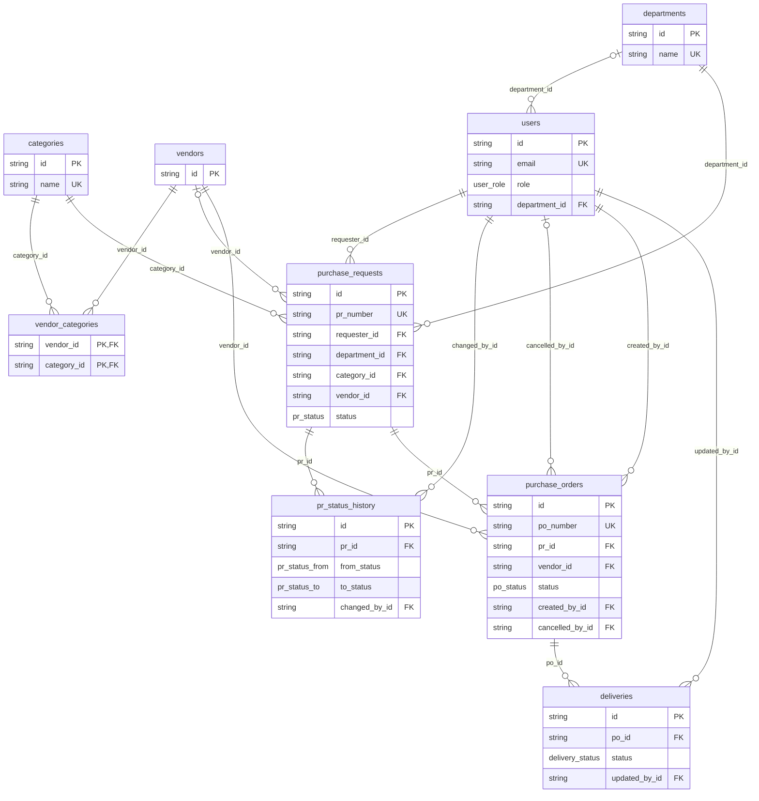

# Database schema

> Generated from the SQLAlchemy models by `backend/scripts/generate_schema_doc.py`. Do not edit by hand: run the script,
> and see `backend/tests/test_schema_doc.py`, which fails when this file is out of date.

PostgreSQL 16, managed with Alembic migrations (`backend/alembic/versions`). Ids are UUID strings generated by the
application. Timestamps (`created_at`, `updated_at`, `changed_at`) are stored as UTC; dates chosen by a user (required
date, delivery date) are calendar dates, not instants.

## Relationships

`||--o{` is one-to-many; `|o--o{` is one-to-many where the link is optional. The diagram lists only keys and status/role
columns; every column is in the tables below.

## Tables

### `categories`

Master data, deactivated rather than deleted. A vendor supplies one or more categories.

| Column | Type | Null | Notes |
|---|---|---|---|
| `id` | `VARCHAR(36)` | no | primary key |
| `name` | `VARCHAR(120)` | no | unique |
| `is_active` | `BOOLEAN` | no |  |

### `departments`

Master data. Deactivated (`is_active = false`) rather than deleted, so history keeps its department.

| Column | Type | Null | Notes |
|---|---|---|---|
| `id` | `VARCHAR(36)` | no | primary key |
| `name` | `VARCHAR(120)` | no | unique |
| `is_active` | `BOOLEAN` | no |  |

### `vendors`

Master data, deactivated rather than deleted. A PR's or PO's vendor must be active and supply the PR's category.

| Column | Type | Null | Notes |
|---|---|---|---|
| `id` | `VARCHAR(36)` | no | primary key |
| `name` | `VARCHAR(180)` | no |  |
| `contact_email` | `VARCHAR(180)` | yes |  |
| `contact_phone` | `VARCHAR(40)` | yes |  |
| `address` | `TEXT` | yes |  |
| `is_active` | `BOOLEAN` | no |  |

### `users`

Everyone who can sign in. The role (REQUESTER, APPROVER, ADMIN) drives what they may do; the department is optional. Accounts with history are deactivated rather than deleted; only an account nothing points at can be deleted.

| Column | Type | Null | Notes |
|---|---|---|---|
| `id` | `VARCHAR(36)` | no | primary key |
| `name` | `VARCHAR(120)` | no |  |
| `email` | `VARCHAR(180)` | no | unique |
| `password_hash` | `VARCHAR(255)` | no | bcrypt hash. The password itself is never stored. |
| `role` | `user_role` | no |  |
| `department_id` | `VARCHAR(36)` | yes | foreign key to `departments.id`; May be empty: a user need not belong to a department. |
| `is_active` | `BOOLEAN` | no | False blocks sign-in and ends any open session at once; the user's history stays. |
| `must_change_password` | `BOOLEAN` | no | default `false`; Set when an admin creates the account or resets its password. The API refuses everything except `/api/auth/me` and the password change until the user has chosen a new one. |
| `created_at` | `TIMESTAMP WITHOUT TIME ZONE` | no |  |

Indexes: `ix_users_email` on (email) (unique).

### `vendor_categories`

Many-to-many link: which categories a vendor supplies. Rows are removed with either side (`ON DELETE CASCADE`).

| Column | Type | Null | Notes |
|---|---|---|---|
| `vendor_id` | `VARCHAR(36)` | no | primary key; foreign key to `vendors.id`, on delete cascade |
| `category_id` | `VARCHAR(36)` | no | primary key; foreign key to `categories.id`, on delete cascade |

Indexes: `ix_vendor_categories_category_id` on (category_id).

### `purchase_requests`

The request that starts the flow. `status` moves DRAFT, SUBMITTED, APPROVED or REJECTED, then COMPLETED once its order is delivered.

| Column | Type | Null | Notes |
|---|---|---|---|
| `id` | `VARCHAR(36)` | no | primary key |
| `pr_number` | `VARCHAR(30)` | no | unique |
| `requester_id` | `VARCHAR(36)` | no | foreign key to `users.id` |
| `department_id` | `VARCHAR(36)` | no | foreign key to `departments.id` |
| `description` | `VARCHAR(500)` | no |  |
| `category_id` | `VARCHAR(36)` | no | foreign key to `categories.id` |
| `amount` | `NUMERIC(14, 2)` | no | Requested amount, in `currency`. |
| `currency` | `VARCHAR(6)` | no |  |
| `required_date` | `TIMESTAMP WITHOUT TIME ZONE` | no | A calendar date (sent as UTC midnight), not an instant. |
| `vendor_id` | `VARCHAR(36)` | yes | foreign key to `vendors.id`; Optional preferred vendor; a PO always has one. |
| `status` | `pr_status` | no |  |
| `revision_required` | `BOOLEAN` | no | default `false`; Set on rejection; cleared only by a real edit, so a rejected PR cannot simply be resubmitted. |
| `created_at` | `TIMESTAMP WITHOUT TIME ZONE` | no |  |
| `updated_at` | `TIMESTAMP WITHOUT TIME ZONE` | no |  |

Indexes: `ix_purchase_requests_pr_number` on (pr_number) (unique).

### `pr_status_history`

Append-only audit trail: one row per status change, with who changed it, when and why. Independent of the mutable `purchase_requests` row.

| Column | Type | Null | Notes |
|---|---|---|---|
| `id` | `VARCHAR(36)` | no | primary key |
| `pr_id` | `VARCHAR(36)` | no | foreign key to `purchase_requests.id` |
| `from_status` | `pr_status_from` | yes | Empty on the first row (creation). |
| `to_status` | `pr_status_to` | no |  |
| `changed_by_id` | `VARCHAR(36)` | no | foreign key to `users.id` |
| `comment` | `VARCHAR(500)` | yes |  |
| `changed_at` | `TIMESTAMP WITHOUT TIME ZONE` | no |  |

### `purchase_orders`

The order raised against an approved PR. Keeps its own `amount` (at most the approved amount) and copies the PR's currency. An OPEN order with no deliveries can be cancelled (status CANCELLED, with the reason, who and when); it stays on record and frees the PR for a new order.

| Column | Type | Null | Notes |
|---|---|---|---|
| `id` | `VARCHAR(36)` | no | primary key |
| `po_number` | `VARCHAR(30)` | no | unique |
| `pr_id` | `VARCHAR(36)` | no | foreign key to `purchase_requests.id` |
| `vendor_id` | `VARCHAR(36)` | no | foreign key to `vendors.id` |
| `amount` | `NUMERIC(14, 2)` | no | Order price. Never more than the approved PR amount. |
| `currency` | `VARCHAR(6)` | no | Copied from the PR. |
| `status` | `po_status` | no |  |
| `created_by_id` | `VARCHAR(36)` | no | foreign key to `users.id` |
| `created_at` | `TIMESTAMP WITHOUT TIME ZONE` | no |  |
| `updated_at` | `TIMESTAMP WITHOUT TIME ZONE` | no |  |
| `cancel_reason` | `VARCHAR(500)` | yes | Why the order was cancelled. Only set when `status` is CANCELLED. |
| `cancelled_by_id` | `VARCHAR(36)` | yes | foreign key to `users.id`; Who cancelled it. Only set when `status` is CANCELLED. |
| `cancelled_at` | `TIMESTAMP WITHOUT TIME ZONE` | yes | When it was cancelled (UTC). Only set when `status` is CANCELLED. |

Indexes: `ix_purchase_orders_po_number` on (po_number) (unique).

### `deliveries`

Append-only delivery updates against a PO. Each update also moves the PO's `status`; DELIVERED completes the PO and its PR.

| Column | Type | Null | Notes |
|---|---|---|---|
| `id` | `VARCHAR(36)` | no | primary key |
| `po_id` | `VARCHAR(36)` | no | foreign key to `purchase_orders.id` |
| `delivery_date` | `TIMESTAMP WITHOUT TIME ZONE` | yes | Required when the status is DELIVERED; a calendar date. |
| `status` | `delivery_status` | no |  |
| `remarks` | `VARCHAR(500)` | yes |  |
| `updated_by_id` | `VARCHAR(36)` | no | foreign key to `users.id` |
| `updated_at` | `TIMESTAMP WITHOUT TIME ZONE` | no |  |

## Enumerated types

| PostgreSQL type | Values |
|---|---|
| `delivery_status` | `PENDING`, `IN_TRANSIT`, `PARTIAL`, `DELIVERED` |
| `po_status` | `OPEN`, `IN_TRANSIT`, `PARTIALLY_DELIVERED`, `DELIVERED`, `COMPLETED`, `CANCELLED` |
| `pr_status` | `DRAFT`, `SUBMITTED`, `APPROVED`, `REJECTED`, `COMPLETED` |
| `pr_status_from` | `DRAFT`, `SUBMITTED`, `APPROVED`, `REJECTED`, `COMPLETED` |
| `pr_status_to` | `DRAFT`, `SUBMITTED`, `APPROVED`, `REJECTED`, `COMPLETED` |
| `user_role` | `REQUESTER`, `APPROVER`, `ADMIN` |

`pr_status_from` and `pr_status_to` are separate PostgreSQL types with the same values as `pr_status`: each of the two status columns of `pr_status_history` declares its own enum.

## Rules enforced in the application, not the schema

- **One active PO per PR.** The schema allows several POs per PR (`purchase_orders.pr_id` is a plain foreign key); the API refuses a second while the first is neither COMPLETED nor CANCELLED. A partial unique index would enforce it in the database (see the README's future enhancements).
- **Cancelling a PO.** Only an OPEN order with no delivery updates can be cancelled, by an approver or admin, with a reason. The row is kept (soft cancel), so orders are never deleted.
- **User administration.** Admins reset passwords (forcing a change at next sign-in), deactivate or reactivate accounts, and delete only accounts with no records pointing at them (requests, status changes, orders, deliveries). Nobody can reset, deactivate or delete their own account.
- **Status transitions.** Which status may follow which is enforced by the API, not by database constraints. Every PR change is written to `pr_status_history`.
- **Vendor must supply the category.** `vendor_categories` records what a vendor supplies; the API checks it when a vendor is chosen on a PR or PO.
- **No self-approval, PO amount cap, delivery-date rules.** Business rules in the API layer.
- **Most foreign-key columns are not indexed.** Only the primary keys, the unique columns and `vendor_categories.category_id` have indexes. Fine at demo scale; the README lists indexing the rest as a future enhancement.
